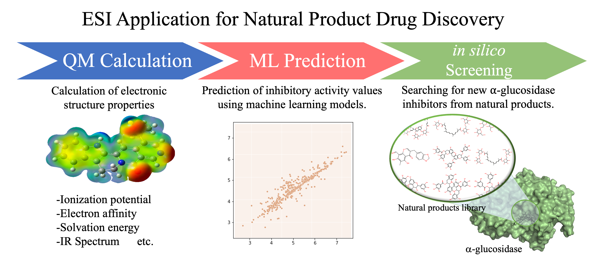

# Electronic-Structure Informatics applicatation for _in silico_ screening for alpha-glucosidase inihbitors from Natural Products databese
 
This repository contains the data, code, and key outputs supporting our manuscript:

**"Is Scaffold Hopping Possible in Machine Learning Using the Electronic-Structure-Informatics (ESI) descriptor set? An Application to Natural-Product-Based Drug Discovery of α-Glucosidase Inhibitors"**  
*Yusuke Tateishi, Manabu Sugimoto*

## Contents

This repository provides the main materials associated with the study, including:

- **Machine-learning datasets and model outputs** (ESI-based models and baseline models (using each descriptor set from RDKit and ECFP4))
- **Natural-product (NP) screening results** (ranked NP hit lists and related analyses)
- **Docking results** (vina scores, docking poses and associated summaries)

## Notes on raw QM files

Due to file size , some raw computational files—particularly full *Gaussian* output files and certain extended computational details—are not included in this public repository. A summary of the computational workflow is provided in the manuscript and Supplementary Information.

Additional raw files may be shared **upon reasonable request**, subject to file organization and availability. If you would like access to materials not included here, please contact the corresponding author.
